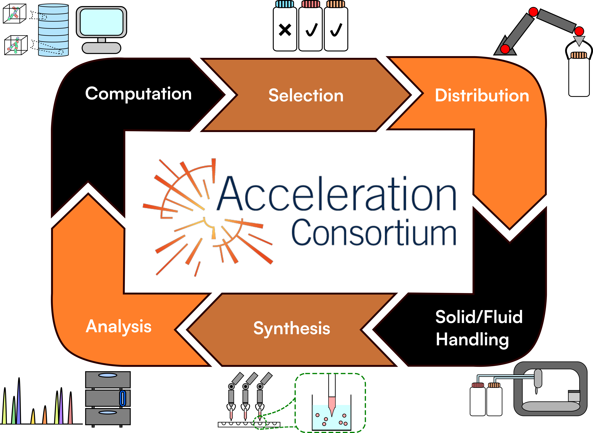

# opentron-automation



## Introduction
We created this repository to coordinate liquid handling with an Opentron&reg; OT-2 robot and data acquisition via external devices. While the OT-2 robot has a Desktop Application and Python API that allows users to create complex liquid handling protocols, there is currently a lack of tools for performing entire experiments in a closed-loop system. Even thought the OT-2 can control hardware modules via usb, it is difficult to integrate input devices or sensors to capture data from samples within the machine. The goal of this respository is overcome these obstacles so that users can:
* Integrate external input devices and sensors
* Coordinate liquid handling and data acquisition
* Perform complex experiments in a high-throughput manner.

## Code Architecture 
The code in this repository is based on Python socket programming. A Server-Client relationship is established between the OT-2 robot (client) and another computer (server). The client and server communicate with each other over the internet via the Transmission Control Protocol (TCP).

The role of the Server and Client devices are outlined below.

Server
* Scheduling tasks (i.e. handling liquid, data acquisition,...)
* Coordinating other peripheral devices
* Sending commands to the client
* Storing experimental data
* Logging

Client
* Handling liquid (i.e. asirating, dispensing)
* Send information to Server about instrument status

Because the OT-2 runs on an immutable operating system, it it is difficult to install external packages on the OT-2. However, there are different built-in networking library in Python that allow the OT-2 communicate with other computers systems and devices. Communicating with external computers systems allows the OT-2 to offload some responsibilities and eliminates the need to install additional packages on the OT-2. Also, by running the Server on a separate system, it can incorporate multiple useful packages to easily extend and customize its functionality of the entire system. Extended capabilites include managing peripheral devices, interfacing with databases for long-term data storage, and task scheduling to coordinate simultaneous experiments.

## Requirements

The repository uses [asyncio](https://docs.python.org/3/library/asyncio.html) ontop of the built-in Python [socket](https://docs.python.org/3/library/socket.html) library is for core Server-Client communication. The built-in Python [pickle](https://docs.python.org/3/library/pickle.html) library is required to serialized data structures so that they can be send over the internet. The Opentrons Python API ([opentrons](https://pypi.org/project/opentrons/)) is required to perform OT-2 operations.

Additional Python libraries may be installed locally and imported into scripts to extend the core functionality of the system.
* opencv-python (digitial image I/O and machine vision)
* pillow (digitial image I/O and image processing)
* skimage (digitial image processing and analysis)
* numpy (matrix arithmetic and manipulation)
* pandas (data organization in table-like data structure)

## Setup of Core Python Functionality
The following Python files and Jupyter Notebook files are required to send command to the OT-2:
* Manager_MQTT.py
* AsyncServer.py
* AsyncServerCommandHandler.py
* Layout.py
* LayoutManager.py
* ClientCommandHandler.py
* main.ipynb

*Depreciated* This repository also contain several files for synchronous operations.
* Manager.py
* LayoutManager.py
* Server.py
* ServerCommandHandler.py
* Client.py
* ClientCommandHandler.py
* Layout.py
* main.ipynb

## Initial Setup and Tutorial
1. Clone this repository onto a local device.
2. Create and activate the conda environment from the environment.yml by running the following commands in your IDE:
```
conda env create -f environment.yml
conda activate RAISE
```
3. Connect to the OT-2 Jupyter Notebook server. For more information, click [here](https://docs.opentrons.com/v2/new_advanced_running.html#jupyter-notebook).
4. Upload the following core files: `ClientCommandHandler.py`, `Layout.py`, and `main.ipynb`.
5. Create a directory in the Jupyter Notebook server called "labware". This is where any JSON files for custom labware should be stored.
6. Run `Manager_MQTT.py` on a local device. It should display the **IP address** and **port number** of the socket that machine opened to communicate with an OT-2 robot and other computer systems. Once the `Manager_MQTT.py` program starts, it will run forever. This allows the "Manager" device to constantly listen for clients to connect to and send instructions. To force the `Manager_MQTT.py` to terminate, use `Ctrl + C` (Windows) or `Cmd + C` (Unix/Linux).

   `python Manager_MQTT.py` (Windows)

   `python3 Manager_MQTT.py` (Unix/Mac/Linux)

   The initial ouput from `Manager_MQTT.py` should look like this:
   ```
   Obtaining CA Certificate
   Server Name: Camera Server
   Hostname: HOSTNAME
   IP Address: SERVER_IP_ADDRESS
   Port #: PORT_NUMBER
   ```
   **Also, the `Manager_MQTT.py` program will also open a camera capture device installed on the local server. A new window will open and display a preview of the camera feed.** This feature adds image capture capabilities to the Server. More about this image capture in next section.
   
7. Open the `main.ipynb`, Copy/Paste the IP address and port number into the correct vaiables in the `main()` coroutine.
```
server_ip = 'SERVER_IP_ADDRESS' # Replace with the IP address of your server
server_port = PORT_NUMBER
```
8. To load pre-defined experimental, make sure to the `USE_MQTT` is set to `False`.

   `USE_MQTT = False # (line 19)`
   
9. Try to connect the OT-2 to the local device.
   - First, run the Manager.py program on the local device.
     
     `python Manager_MQTT.py` (Windows) or `python3 Manager_MQTT.py` (Unix/Mac/Linux)
     
   - Run run cell 1 on the Jupyter Notebook. **Note:** It may take a while on the Jupyter Notebook the first time it runs. Be patient.
   - If a connection has been established, both programs should run to completion without raising any errors.
  
     **Note:** The IP address of the local device may change after shutting down or restarting. Make sure the correct IP address is entered in the `main.ipynb`.

## Tutorial
Here is an overview of how to initiatiate the Server and run a simple sequence of OT-2 operations.
1. On the Server, run the `Manager_MQTT.py` program. It should run forever until `Ctrl + C` or `Cmd + C` is pressed.
   `python Manager_MQTT.py` (Windows)

   `python3 Manager_MQTT.py` (Unix/Mac/Linux)
2. If `USE_MQTT = False # (line 19)`, the coroutine function `handle_client` will run. The function signature is explained below.
   
   `async def handle_client(reader: asyncio.StreamReader, writer: asyncio.StreamWriter, handler: AsyncServerCommandHandler, layout_manager: LayoutManager)`
   
   `reader` takes an `asyncio.StreamReader` object which reads data from the OT-2 robot.
   
   `writer` takes an `asyncio.StreamWriter` object which sends commands/data to the OT-2 robot.
   
   `handler` takes an `AsyncServerCommandHandler` object. This object is responsible for organizing the commands that are send to the OT-2. Command data is organized in python dictionaries, including keyword arguments that are passed to the opentron API functions on the OT-2. More detail about `AsyncServerCommandHandler` below.
   `layout_manager` takes an `LayoutManager` object. This object stores information about the labware on the OT-2 deck and the two pipette instruments mounted on the gantry arm. This information is send to the OT-2 to instantiate labware and instruments before any operations can be performed.

3. Run cell 1 on the main.ipynb on the OT-2 Jupyter notebook server.
4. After the OT-2 connects with the Server, an sequence of OT-2 operations will be read from a separate file and executed.

  `await offline_experiment(handler, layout_manager) # line 38`

  The sequence of commands in the file looks like this:

  ```
 await asyncio.sleep(5)
 await handler.send_command(layoutmanager.layout_params)
 await handler.pick_up_tip('LEFT')
 await handler.move('LEFT', 10, 'A1')
 await handler.aspirate('LEFT', 10, 'A1', 100)
 await handler.dispense('LEFT', 4, 'A1', 100)
 await handler.move("LEFT", 4, 'A1', (0.5, -92.5, 0))
 await handler.capture_image('./OFFLINE_EXPERIMENT_IMAGE_CAPTURE_TEST.jpg')
 await asyncio.sleep(15)
 await handler.move("LEFT", 4, 'A1')
  ```

Currently, the following commands are supported by `AsyncServerCommandHandler.py`:
* `await handler.send_command(layoutmanager.layout_params)` sends the OT-2 the layout of the labware placed on the OT-2 deck and which pipettes are mounted on the gantry. **Note:** This command should come before all other OT-2 commands.
  
     `layoutmanager = LayoutManager('./OT2_Layout.txt') # line 134` reads the `OT2_Layout.txt` for labware locations and position offset value. Position offset values should be determined with the OT-2 app prior to running experimental protocols. Take a look at `OT2_Layout.txt` and `LayoutManager.py` for information about what layout information is passed to the the OT-2.
  
* `async def move(self, instrument: str, labware_idx: int, well_name: str, offset: tuple[int, int, int] = (0, 0, 0), adjust: tuple[int, int, int] = (0, 0, 0))`
  
     `instrument` takes either 'LEFT' or 'RIGHT'. This parameter tells the OT-2 which pipette mounted on its gantry to move.
  
     `labware_idx` takes an integer between 1 and 11, inclusive. This parameter tells the OT-2 which deck slot to move to.
  
     `well_name` takes a string representation of the well that the instrument should move to (e.g. 'A1', 'B1', 'C1', ...).

     `offset` and `adjust` take tuples containing three float values. These float values represent the x, y, and z offset values, in mm, to move the instrument. Positive x values move the instrument to the right. Positive y values move the instrument towards the back of the OT-2. Positive z values raise the instrument upwards.

     For example, `await handler.move("LEFT", 4, 'A1', (0.5, -92.5, 0))` tells the OT-2 to move the **left** mounted pipette to move **0.5mm** to the right and **92.5mm** forward relative to well **A1** of the labware placed on slot **4** on the OT-2 deck.
  
* `async def transfer(self, instrument: str, volume: float | List[float], source_labware: int, source_wells: str | List[str], dest_labware: int, dest_wells: str | List[str], new_tip: str = "Once"):`
  
     `instrument` takes either 'LEFT' or 'RIGHT'. This parameter tells the OT-2 which pipette mounted on its gantry to use for pipetting.
  
     `source_labware` and `dest_labware` take an integer between 1 and 11, inclusive. These parameters tells the OT-2 which deck slot to transfer liquid from and to, respectively.

     `source_wells` and `dest_wells` takes either a string representation of a well or a list of string representations of wells. These parameters tell the OT-2 which wells to transfer liquide from and to, respectively.

     `new_tip` takes a string which tell the OT-2 when to change tips between consecutive transfer steps.

  For more information, click [here](https://docs.opentrons.com/v2/new_protocol_api.html#opentrons.protocol_api.InstrumentContext.transfer).

* `async def distribute(self, instrument: str, volume: float | List[float], source_labware: int, source_wells: str, dest_labware: int, dest_wells: str | List[str]):`
  
     `instrument` takes either 'LEFT' or 'RIGHT'. This parameter tells the OT-2 which pipette mounted on its gantry to use for pipetting.
  
     `source_labware` and `dest_labware` take an integer between 1 and 11, inclusive. These parameters tells the OT-2 which deck slot to transfer liquid from and to, respectively.

     `source_wells` takes a string and `dest_wells` takes a list of string representations of wells. These parameters tell the OT-2 which wells to transfer liquide from and to, respectively. Unlike `transfer`, `distribute` transfers liquid from one well to many wells.

* `async def aspirate(self, instrument: str, labware_idx: int, well_name: str, volume: float)`
  
     `instrument` takes either 'LEFT' or 'RIGHT'. This parameter tells the OT-2 which pipette mounted on its gantry to use for pipetting.
  
     `source_labware` takes an integer between 1 and 11, inclusive. These parameters tells the OT-2 which deck slot to aspirate liquid from.

     `well_name` takes a string representation of the well on the `source_labware` that the OT-2 should aspirate liquid from.

      `volume` takes a float. This parameter tells the OT-2 how much liquid, in uL, it should aspirate.

     For example, `await handler.aspirate('LEFT', 10, 'A1', 100)` aspirates **100uL** from well **A1** from slot **10** using the **left** mounted pipette.


* `async def dispense(self, instrument: str, labware_idx: int, well_name: str, volume: float, rate: float = 1, depth: float = 0)`
  
     `instrument` takes either 'LEFT' or 'RIGHT'. This parameter tells the OT-2 which pipette mounted on its gantry to use for pipetting.
  
     `labware_idx` takes an integer between 1 and 11, inclusive. These parameters tells the OT-2 which deck slot to dispense liquid into.

     `well_name` takes a string representation of the well on the `source_labware` that the OT-2 should dispense liquid into.

     `volume` takes a float. This parameter tells the OT-2 how much liquid, in uL, it should dispense.

     `rate` takes a float. This parameter gives the OT-2 the flow rate for dispensing liquid.

     `depth` takes a float. This parameter tell the OT-2 the vertical offset from the center of the well at which to dispense liquid.

     For example, `await handler.dispense('LEFT', 4, 'A1', 100)` dispenses **100uL** to well **A1** from slot **4** using the **left** mounted pipette.

* `async def airgap(self, instrument: str, volume: float)`
  
     `instrument` takes either 'LEFT' or 'RIGHT'. This parameter tells the OT-2 which pipette mounted on its gantry to use for pipetting.

      `volume` takes a float. This parameter tells the OT-2 how much air, in uL, it should dispense.

* `async def pick_up_tip(self, instrument: str)`
  
     `instrument` takes either 'LEFT' or 'RIGHT'. This parameter tells the OT-2 which pipette mounted on its gantry to pick up a tip with.
  
* `async def drop_tip(self, instrument: str)`
  
     `instrument` takes either 'LEFT' or 'RIGHT'. This parameter tells the OT-2 which pipette mounted on its gantry to discard its tip.

* `async def new_tip(self, instrument: str)`
  
     `instrument` takes either 'LEFT' or 'RIGHT'. This parameter tells the OT-2 which pipette mounted on its gantry to pick up a tip with. If the pipette already has a tip, it will first discard the tip in the trash bin and then pick up a new tip.

* `async def capture_image(self, fname: str)`
  
     This method reads data from a image capture device connected to the Server and saves it as a file.
     `fname` takes a string representing the filepath on the Server to save the image.

     For example, `await handler.capture_image('./OFFLINE_EXPERIMENT_IMAGE_CAPTURE_TEST.jpg')` saves a jpg image called "OFFLINE_EXPERIMENT_IMAGE_CAPTURE_TEST.jpg" in the same directory as the `Manager_MQTT.py` file.

Methods within `AsyncServerCommandHandler.py` can be modified to connect to and read input from other peripheral devices. Currently, `capture_image` only allows for reading images from a connected camera device. Take a look at the `AsyncServerCommandHandler.py` for more information.

     
## ===Sections beyond this are deprecated and no longer supported===


## Initial Setup for Synchronous Client
1. Clone this repository onto a local device.
2. Connect to the OT-2 Jupyter Notebook server. For more information, click [here](https://docs.opentrons.com/v2/new_advanced_running.html#jupyter-notebook).
3. Upload the following core files: `Client.py`, `ClientCommandHandler.py`, `Layout.py`, and `main.ipynb`.
4. Create a directory in the Jupyter Notebook server called "labware". This is where any JSON files for custom labware should be stored.
5. Run `Manager.py` on a local device. It should display the **IP address** and **port number** of the socket that machine opened to send/receive messages. After 30secs, the program should timeout and terminate.
6. Open the `main.ipynb`, Copy/Paste the IP address and port number into the correct vaiables in the `run()` function.
```
IP_ADDRESS = "LOCAL_IP_ADDRESS"
PORT = PORT_NUMBER
```
7. Try to connect the OT-2 to the local device.
   - First, run the Manager.py program on the local device.
     
     `python Manager.py` (Windows)
     
     `python3 Manager.py` (Unix/Mac/Linux)
     
   - Run run the cell containing the `run()` function on the Jupyter Notebook. **Note:** It may take a while on the Jupyter Notebook the first time it runs. Be patient.
   - If a connection has been established, both programs should run to completion without raising any errors.
  
     **Note:** The IP address of the local device may change after shutting down or restarting. Make sure the correct IP address is stored in the `main.ipynb`.

## Tutorial
The Manager.py contains a simple script that instructs the OT-2 to pick up a tip and move to a location relative to the location of one well.

Firstly, take a look at the following code.
```
if __name__ == '__main__':
    OFFSET = (0.5, -92.5, 0)
    # Instantiate main server
    server_main = Server(name='Camera Server', port=1200)

    # Instantiate command handler
    handler = ServerCommandHandler()
    handler.set_camera(Camera(cam_idx=0, name='Camera 1'))

    with server_main, handler:
        server_socket = server_main.get_socket()
        client_socket, client_addr = server_socket.accept()
        client_socket.settimeout(60)

        handler.set_socket(client_socket)
```
Breakdown:
1. `server_main = Server(name='Camera Server', port=1200)`. Instantiate a socket on the local device and binds a port to it. The port listens for client connections.
2. `handler = ServerCommandHandler()`. Creates an object (`handler`) that will send commands to the OT-2.
3. `handler.set_camera(Camera(cam_idx=0, name='Camera 1'))`. In this demo script a `Camera` object is created and bound to the `handler` object. The `handler` is responsible for managing peripheral devices connected to the Server.
4. `server_socket = server_main.get_socket(); client_socket, client_addr = server_socket.accept()`. These two lines listens for and accepts a client connection (OT-2). **Note:** The server socket can only accept 1 client connection, though it is possible to accept multiple connections by modifying the code.
5. `handler.set_socket(client_socket)`. Binds the `client_socket` to `handler` object. Now, `handler` is ready to send commands to the OT-2 to transfer liquids.

Next,
```
# Send layout of labware arrangements and pipettes to the OT-2
layoutmanager = LayoutManager('./OT2_Layout.txt')
handler.send_command(layoutmanager.layout_params)
```
`OT2_Layout.txt` is a small text file that describes the layout of the OT-2 deck and pipetting instruments on the OT-2 gantry. The first 11 lines gives the labware names and position offsets. **Note:** Labware position offset check should be performed prior to running `Manager.py` to avoid collisions and ensure proper liquid transfering.

`layoutmanager = LayoutManager('./OT2_Layout.txt')` reads the `OT2_Layout.txt`.

`handler.send_command(layoutmanager.layout_params)` sends the information in the `OT2_Layout.txt` file to the OT-2 to instantiate all labware and instruments. **Note:** This command should come before all other OT-2 commands.

These lines are examples of commands that are sent to the OT-2.
```
handler.pick_up_tip('LEFT')
handler.move('LEFT', 10, 'A1', OFFSET)
```
`handler.pick_up_tip('LEFT')` tells the OT-2 to pick up a tip using the instrument on the left of the gantry.

`handler.move('LEFT', 10, 'A1', OFFSET)` tells the **left** instrument on the OT-2 to move to the offsetted position relative to well **A1** on slot **10**.

The following lines of code is an example of the script taking input from the user. In this specific example, it is intended to allow the user to adjust the focus of the camera if necessary before proceeding to the rest of the experiment.
```
# Camera Preview. Adjust position or focus as necessary. Type 'Y' to continue; Type 'N' to exit
while True:
   usr_input = input('Proceed? Y/N...\n')
   usr_input = usr_input.upper()
   if usr_input == 'Y':
       break
   elif usr_input == 'N':
       exit(0)
```

## At The Moment

