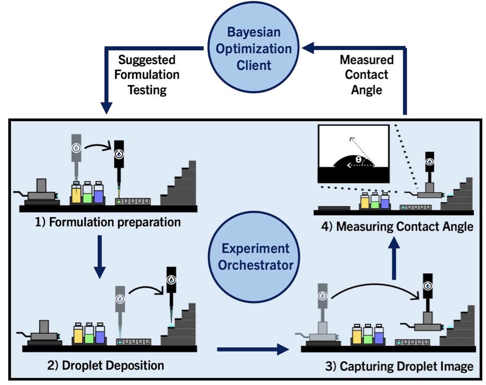

# RAISE: A self-driving laboratory for interfacial property formulation discovery 

## Abstract
Surface wettability is a critical design parameter for biomedical devices, coatings, and textiles. Contact angle measurements quantify liquid-surface interactions, which depend strongly on liquid formulation. Herein, we present the Robotic Autonomous Imaging Surface Evaluator (RAISE), a closed-loop, self-driving laboratory that is capable of linking liquid formulation optimization with surface wettability assessment. RAISE comprises a full experimental orchestrator with the ability of mixing liquid ingredients to create varying formulation cocktails, transferring droplets of prepared formulations to a high-throughput stage, and using a pick-and-place camera tool for automated droplet image capture. The system also includes an automated image processing pipeline to measure contact angles. This closed loop experiment orchestrator is integrated with a Bayesian Optimization (BO) client, which enables iterative exploration of new formulations based on previous contact angle measurements to meet user-defined objectives. The system operates in a high-throughput manner and can achieve a measurement rate of approximately 1 contact angle measurement per minute. Here we demonstrate RAISE can be used to explore surfactant wettability and how surfactant combinations create tunable formulations that compensate for purity-related variations. Furthermore, multi-objective BO demonstrates how precise and optimal formulations can be reached based on application-specific goals. The optimization is guided by a desirability score, which prioritizes formulations that are within target contact angle ranges, minimize surfactant usage and reduce cost. This work demonstrates the capabilities of RAISE to autonomously link liquid formulations to contact angle measurements in a closed-loop system, using multi-objective BO to efficiently identify optimal formulations aligned with researcher-defined criteria.

## Orchestration Software Architecture
The RAISE ochestrator coordinates liquid transfer capabilities of the Opentrons OT-2 and the image capture abilities of the camera device. The orchestrator software runs on a computer that connects to the OT-2 on a local area network and connects to the camera device via USB. The orchestrator communicates to the OT-2 by sending commands to the liquid handler. A simple program that is executed on the OT-2 receives incoming commands and interfaces with the Opentrons API to execute individual liquid transfer tasks.

Launch Orchestrator
1) Open a new terminal
2) Navigate to RAISE directory
3) Enter *python Orchestrator.py* in the terminal to start the orchestrator
4) Once the OT-2 client connects to the orchestrator, the camera device and bayesian optimizer will begin setting up

Launch Client Process on OT-2
1) Open the Opentrons App
2) Launch Jupyter Notebook in the Advanced Settings menu
3) Upload necessary files to the Jupyter Notebook
4) Open a new terminal from the Jupyter Notebook
5) Enter *python3 /var/lib/jupyter/notebooks/main.py* to start the OT-2 client application
6) Once the OT-2 connects to the orchestrator, it will repeatedly await new command and then execute them.

## Processing User Inputs
One way for users to easily to set up different experiments, they can enter different parameters using a web user interface.

Launch Web Graphical User Interface
1) Open a new terminal
2) Navigate to RAISE directory
3) Enter *python RAISE_App.py* in the terminal to lauch the web server
4) Open a browser and enter *http://127.0.0.1:5000/RAISE/* to open the user interface
5) Follow the instructions in the web interface and enter necessary parameters to the correct fields to design a new experiment
6) Once all parameters are entered, press *submit* at the bottom of the page

After user inputs are submitted, a USER_INPUTS.json configuration file is created in the PARAMETERS directory. Once the orchestrator launches, it reads from the configuration file and parses its contents to create additional configuration files that the orchestrator uses to design new experimental campaigns. Alternately, users can edit the USER_INPUTS.json configuration file to directly make edits to the campaign design.
